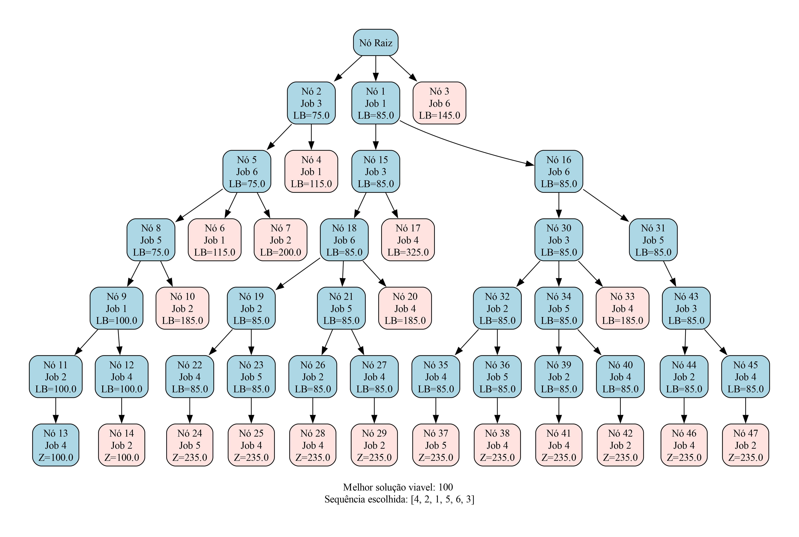

# Projeto de Sequenciamento da Produção

> Trabalho desenvolvido na disciplina **“Sequenciamento da Produção: Problemas, Modelagem e Algoritmos”**  
> do curso de **Engenharia de Produção da UFMG**, ministrada pelo **Prof. Maurício**.

---

## Alunos
- **Danilo Teixeira Gonçalves Campos - 2021019076**  
- **Victória Dias de Almeida - 2021072201**

---

## Descrição do Projeto

Este projeto tem como objetivo a **resolução de um problema de sequenciamento da produção** por meio da **técnica de Branch and Bound**, implementada na linguagem **Julia**.

O método de **relaxação adotado** foi o **modelo de transporte**, resolvido utilizando **Programação Linear (PL)** através do **solver HiGHS**.
A cada nó da árvore de busca, a relaxação é usada para obter um *lower bound*, e a estratégia de **poda** é aplicada para otimizar o espaço de busca.

---

## Resultados

O gráfico abaixo representa a **árvore de decisão gerada** ao fim da execução do programa, bem como a solução final e a sequência relacionada à solução. Os nós em vermelho representam os nós podados pelo *lower bound*.



[`bnb_tree.pdf`](./results/bnb_tree.pdf)

A árvore foi criada utilizando a **linguagem DOT**, e posteriormente **convertida para PDF** com o programa **Graphviz** instalado localmente.

Exemplo do comando utilizado para a conversão:
```bash
dot -Tpdf bnb_tree.dot -o bnb_tree.pdf
